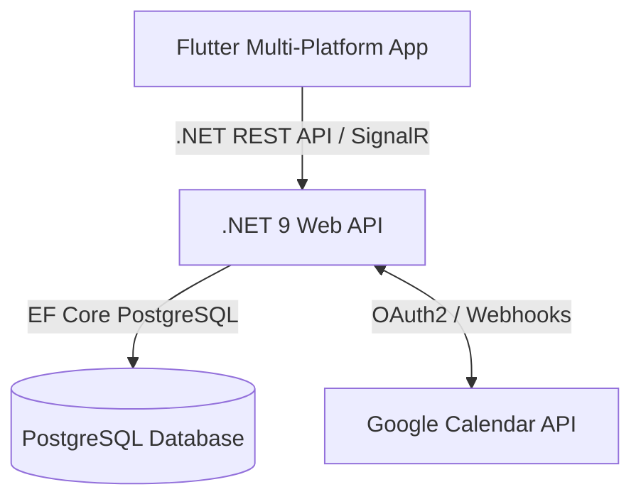

# PRD 01: Product Vision, Core Features & System Architecture

## 1. Product Vision & Core Idea
**Habit Tracker** is an intelligent multi-platform habit tracking and calendar scheduling system (Mobile, Web, Desktop). The product combines **Habit Tracking**, **Two-Way Google Calendar Sync**, **Focus Management (Pomodoro)**, and **Interactive Analytics & Gamification**.

### Core Value Propositions
1. **Seamless Calendar & Habit Sync**: Converts daily habits into dynamic schedule slots, supporting real-time bi-directional synchronization with Google Calendar via Webhooks and SignalR.
2. **Interactive Analytics & Performance**: Visualizes habit completion rates, focus time distribution, heatmaps, and streak tracking.
3. **Cross-Platform Native Experience**: Modern UI (Shadcn UI style), native Android App Widgets (Glance Composables), and instant synchronization across devices.
4. **Gamification & Focus Tools**: Integrated Pomodoro Timer, XP progression, level-ups, and cosmetic rewards (Avatars/Borders) to maintain user motivation.

---

## 2. System Architecture Overview

The system follows a **Clean Architecture + CQRS Modular Architecture** with clear separation between the Flutter Frontend and .NET Core Backend.

---

## 3. Technology Stack & Component Specifications

### 3.1. Frontend: Flutter Application (`/apps`)
* **Architecture Pattern**: Clean Architecture + Feature-First structure.
* **State Management**: Flutter Riverpod (`AsyncNotifier`, `FutureProvider`, `StreamProvider`).
* **UI Components**: `shadcn_ui` + `lucide_icons` + custom responsive design.
* **Native Integration**: Android Jetpack Glance (App Widgets for Today's Events & Upcoming Tasks).
* **Key Features**:
  - Offline-first cache & Stale-while-revalidate data strategy.
  - Interactive Habit Dock & Heatmap Calendar.
  - Real-time updates via SignalR connection.
  - Multi-language Support (i18n English / Vietnamese).

### 3.2. Core Backend: .NET 9 Web API (`/server`)
* **Architecture Pattern**: Clean Architecture + CQRS with MediatR + Repository Pattern.
* **Database & ORM**: PostgreSQL 16 + Entity Framework Core 9.
* **Real-time Engine**: SignalR Hubs (`CalendarHub`, `HabitHub`).
* **Security & Auth**: ASP.NET Core Identity + JWT Bearer Authentication.
* **External Services**: Google Calendar API v3 (OAuth2 Token Refreshing, Webhook Receiver, Push Notifications).
* **Key Modules**:
  - `HabitTracker.Domain`: Entities (Habit, Event, DailySummary, Cosmetics, User).
  - `HabitTracker.Application`: Commands, Queries, Behaviors (Validation, Logging).
  - `HabitTracker.Infrastructure`: Persistence, Google API Service, SignalR.
  - `HabitTracker.Web`: Endpoints (Minimal APIs / Controllers), Webhooks, Middlewares.

---

## 4. Key Data Flow Models

### 4.1. Two-Way Google Calendar Sync Flow
1. **Outbound**: User creates/edits an Event on Flutter App $\rightarrow$ .NET Web API receives command $\rightarrow$ Creates Event on Google Calendar $\rightarrow$ Emits SignalR push to update UI.
2. **Inbound**: User updates schedule on Google Calendar $\rightarrow$ Google sends Webhook ping to `.NET /api/v1/webhooks/google-calendar` $\rightarrow$ Background Job syncs delta $\rightarrow$ Pushes SignalR notification $\rightarrow$ Flutter Client updates UI seamlessly without manual reload.

### 4.2. Analytics & Performance Tracking Flow
1. Client requests habit analytics for a selected period $\rightarrow$ Calls `/api/v1/analytics/summary`, `/time-distribution`, `/performance` on .NET Backend.
2. Backend queries aggregated metrics and daily summaries directly from PostgreSQL.
3. Response is cached on the client using Stale-While-Revalidate pattern for fast navigation.
