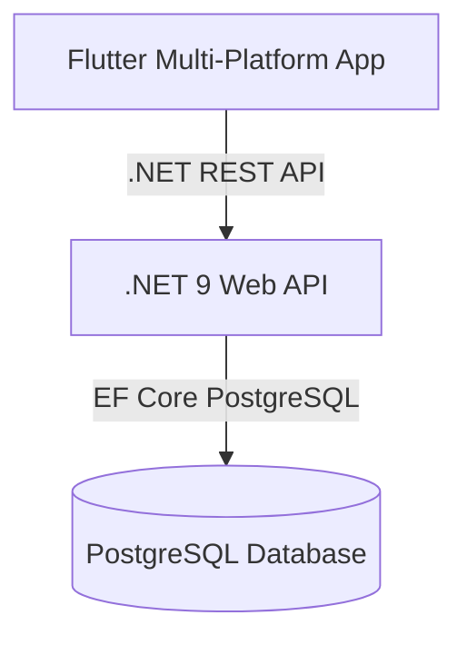

# PRD 01: Product Vision, Core Features & System Architecture

## 1. Product Vision & Core Idea
**Habit Tracker** is a cross-platform application (Mobile, Web, Desktop) designed to help users establish, track, and manage daily habits and scheduled events effectively.

### Core Value Propositions
1. **Habit & Event Scheduling**: Plan daily habits and map them into clear time slots on an interactive calendar.
2. **Progress & Analytics Tracking**: Monitor habit completion rates and daily summaries.
3. **Cross-Platform Experience**: Built with Flutter for a responsive and consistent user experience across Web, Desktop, and Mobile.

---

## 2. System Architecture Overview

The system is designed with a clean, decoupled architecture separating the Flutter multi-platform client from the .NET Core backend.

---

## 3. Technology Stack & Component Specifications

### 3.1. Frontend: Flutter Application (`/apps`)
* **Architecture Pattern**: Clean Architecture + Feature-First structure.
* **State Management**: Flutter Riverpod (`AsyncNotifier`, `FutureProvider`).
* **UI Components**: Modern responsive design tokens and component styling.

### 3.2. Core Backend: .NET 9 Web API (`/server`)
* **Architecture Pattern**: Clean Architecture + CQRS with MediatR.
* **Database & ORM**: PostgreSQL + Entity Framework Core 9.
* **Key Modules**:
  - `HabitTracker.Domain`: Entities (`Habit`, `Event`).
  - `HabitTracker.Application`: Use cases, Commands & Queries for Habits and Events.
  - `HabitTracker.Infrastructure`: EF Core DbContext & Persistence Repositories.
  - `HabitTracker.Web`: REST Endpoints & Web API Controllers.
