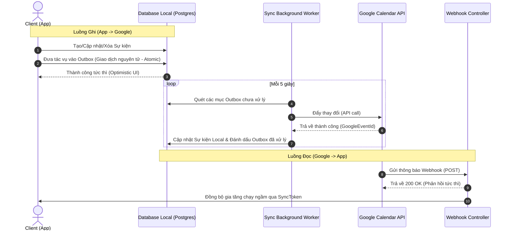

# Kiến trúc Đồng bộ Google Calendar Hai chiều

Tài liệu này mô tả phương pháp tiếp cận kiến trúc, cấu trúc dữ liệu và luồng đồng bộ hóa được triển khai cho tích hợp Google Calendar hai chiều.

---

## 1. Tổng quan Kiến trúc

Để đảm bảo tính toàn vẹn dữ liệu, khả năng hoạt động ngoại tuyến (offline) và phản hồi giao diện người dùng tức thì, tích hợp được thiết kế theo mô hình **Ghi dựa trên sự kiện / Outbox ở Local** kết hợp với **Kéo dữ liệu gia tăng dựa trên Webhook**.



---

## 2. Các Thực thể & Cấu trúc Dữ liệu Cốt lõi

### GoogleCalendarOutbox

Đóng vai trò là nhật ký giao dịch (transaction log) cho các thay đổi được bắt đầu từ ứng dụng.

```json
{
  "Id": "a1b2c3d4-e5f6-7a8b-9c0d-e1f2a3b4c5d6",
  "UserId": "user-uuid-12345",
  "EventId": "event-uuid-67890",
  "GoogleEventId": "google-calendar-event-id",
  "Action": "Insert | Update | Delete",
  "Payload": {
    "Title": "Morning Jog",
    "StartTime": "2026-07-31T06:00:00Z",
    "EndTime": "2026-07-31T07:00:00Z",
    "RecurrenceRule": "FREQ=DAILY;INTERVAL=1"
  },
  "CreatedAt": "2026-07-30T19:30:00Z",
  "ProcessedAt": null,
  "Error": null,
  "RetryCount": 0
}
```

### GoogleCalendarChannel

Theo dõi các đăng ký webhook hoạt động (Google Calendar Watch).

```json
{
  "Id": "channel-uuid-guid",
  "ResourceId": "google-resource-id-string",
  "UserId": "user-uuid-12345",
  "Expiration": "2026-08-06T19:30:00Z"
}
```

---

## 3. Luồng Dữ liệu Chi tiết

### A. Từ App đến Google (Đẩy / Xử lý Outbox)

1. **Kích hoạt**: Bất kỳ lệnh MediatR nào sửa đổi sự kiện (`CreateEvent`, `UpdateEvent`, `DeleteEvent`, `CompleteEventSession`) đều ghi nhận thay đổi vào `GoogleCalendarOutbox` nếu người dùng đã bật đồng bộ Google Calendar.
2. **Thực thi Worker**: `GoogleCalendarSyncWorker` chạy như một dịch vụ nền được lưu trữ (`IHostedService`).
3. **Logic thực thi**:
   - **Insert**: Tải sự kiện lên. Khi thành công, Google trả về `GoogleEventId`, mã này sẽ được ghi ngược lại vào bản ghi `Event` local.
   - **Update**: Cập nhật Google Calendar bằng `GoogleEventId` đã đăng ký. Hỗ trợ ghi đè phiên bản sự kiện lặp lại (exception dates).
   - **Delete**: Xóa sự kiện khỏi Google Calendar.

### B. Từ Google đến App (Nhận thông báo / Xử lý Webhook)

1. **Xác minh**: Khi đăng ký Webhook qua `Events.Watch`, Google gửi một ping xác minh với tiêu đề `X-Goog-Resource-State: sync`. Endpoint Webhook phản hồi `200 OK` ngay lập tức.
2. **Cập nhật**: Khi có bất kỳ thay đổi nào trực tiếp trên Google Calendar (web hoặc app chính chủ):
   - Google gọi `POST /api/v1/webhooks/google-calendar`.
   - Webhook tìm người dùng liên kết qua `ChannelId` trong bảng `GoogleCalendarChannels`.
   - Nó kích hoạt một tiến trình **Đồng bộ hóa gia tăng** (`SyncEventsAsync`) trong một luồng nền để tránh chặn webhook của Google (ngăn lỗi timeout).
   - Tiến trình đồng bộ sẽ cập nhật DB local và làm mới các widget trên màn hình chính Android trong thời gian thực.

---

## 4. Cấu hình Đường truyền Local (Local Tunneling) cho Webhook

Trong quá trình phát triển ở local, Google phải có thể tiếp cận backend localhost của bạn qua giao thức HTTPS.

1. **Phơi bày Port API Local**:
   ```bash
   devtunnel host -p 5000 --allow-anonymous
   # Hoặc sử dụng ngrok:
   ngrok http 5000
   ```
2. **Cập nhật appsettings.json**:
   ```json
   "GoogleCalendar": {
     "WebhookBaseUrl": "https://xyz.ngrok-free.app"
   }
   ```
   _Lưu ý: Đảm bảo WebhookBaseUrl không kết thúc bằng dấu gạch chéo (/)._
