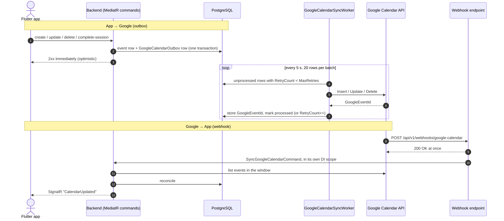

# Google Calendar two-way sync — architecture

How events move between the app and a user's primary Google Calendar: the data structures, the
three flows, and the known limits. Read this, and `stale-while-revalidate-sync.md`, before
changing anything under `GoogleCalendar*`, `SyncEventsAsync` or the event commands.

**Status:** matches the code as of September 2026 (`main` after PR #28). Where behaviour is
documented here but only verified by reading the code, it says so.

---

## 1. Design in one paragraph

Writes are **optimistic and local-first**. Changing an event commits the event and an *outbox*
row in the same database transaction, the API answers immediately, and a background worker
pushes the outbox to Google afterwards. Reads from Google are **reconciliation over a time
window**. A sync lists the user's Google events in a window and brings the local rows in line
with the list. A sync can be started by three triggers: a Google webhook, the app itself, or a
read of the events endpoint. When a sync that the client did not start finishes, the server
tells the client over SignalR so it can refetch.


```mermaid
sequenceDiagram
    autonumber
    actor App as Flutter app
    participant API as Backend (MediatR commands)
    participant DB as PostgreSQL
    participant Worker as GoogleCalendarSyncWorker
    participant Google as Google Calendar API
    participant Hook as Webhook endpoint

    Note over App,DB: App → Google (outbox)
    App->>API: create / update / delete / complete-session
    API->>DB: event row + GoogleCalendarOutbox row (one transaction)
    API-->>App: 2xx immediately (optimistic)
    loop every 5 s, 20 rows per batch
        Worker->>DB: unprocessed rows with RetryCount < MaxRetries
        Worker->>Google: Insert / Update / Delete
        Google-->>Worker: GoogleEventId
        Worker->>DB: store GoogleEventId, mark processed (or RetryCount++)
    end

    Note over Google,App: Google → App (webhook)
    Google->>Hook: POST /api/v1/webhooks/google-calendar
    Hook-->>Google: 200 OK at once
    Hook->>API: SyncGoogleCalendarCommand, in its own DI scope
    API->>Google: list events in the window
    API->>DB: reconcile
    API-->>App: SignalR "CalendarUpdated"
```

---

## 2. Data structures

### `GoogleCalendarOutbox` — the app's pending changes

| Column | Meaning |
| --- | --- |
| `EventId` | the local event the change is about |
| `GoogleEventId` | Google's id, once known; may be filled in by the worker at send time |
| `Action` | `Insert`, `Update` or `Delete` |
| `Payload` | JSON: title, start/end, recurrence rule, exception dates, and for a split-off day its `ParentEventId` and `ExceptionDate` |
| `ProcessedAt` | set when the change reached Google, or when it can never be sent (no refresh token) |
| `RetryCount` | failed attempts; the worker stops at `GoogleCalendarOutbox.MaxRetries` (5) |
| `Error` | the last failure message |

A row the worker has given up on keeps `ProcessedAt = null`. That row is **not** "pending": code
that asks "does Google know, or is it about to know, this event?" must also check
`RetryCount < MaxRetries` (`HasPendingInsertAsync`, `GoogleSyncGuard.GoogleKnowsAsync`).

### `GoogleCalendarChannel` — the webhook subscription

| Column | Meaning |
| --- | --- |
| `Id` | the channel id Google echoes back in `X-Goog-Channel-ID` |
| `ResourceId` | Google's resource id, needed to stop the channel |
| `UserId` | whose calendar it watches |
| `Expiration` | when Google stops delivering; renewed when under 24 hours remain |

### `GoogleCalendarSyncCache` — which windows were recently reconciled

`SyncedFrom`, `SyncedTo` and `LastSyncedAt` per user. A window counts as fresh when a single cache
row covers it and was synced within the last minute. Overlapping rows are merged on save.

---

## 3. App → Google: the outbox

1. **Enqueue.** `CreateEventCommand`, `UpdateEventCommand`, `DeleteEventCommand` and
   `CompleteEventSessionCommand` enqueue a row when the user has a Google refresh token.
2. **Worker.** `GoogleCalendarSyncWorker` (a `BackgroundService`) runs every 5 seconds. Each pass
   uses a fresh DI scope and takes up to 20 unprocessed rows, oldest first.
   - **Insert** creates the event. For a split-off day it instead updates the matching instance of
     the parent series. It writes the returned `GoogleEventId` back to the local event.
   - **Update** needs a `GoogleEventId`. If the row has none, the worker reads it from the local
     event, and fails the attempt if Google has never seen that event. For a series it also sends
     the exception dates, so Google cancels those instances.
   - **Delete** removes the event on Google, when an id is known.
3. **Failure.** Any exception increments `RetryCount` and records `Error`. After `MaxRetries` the
   row is left unprocessed and is no longer picked up.

**Guarding against impossible sends.** Queueing an `Update` for an event Google has never seen can
only fail five times. Commands check `GoogleSyncGuard.GoogleKnowsAsync` first, which is true when
the event has a `GoogleEventId` or an Insert is still pending. When neither holds, they queue an
Insert (or nothing) instead.

### Repeating events and per-day state

A series is one row. A day of it becomes its own row only when something happens to that day
(`OccurrenceMaterializer`, see `CLAUDE.md`). Such a **local-only day** is deliberately *not* pushed,
and *not* added to the series' exception dates: the next push of the series would carry that
date and Google would cancel the day. It is pushed only when the user actually edits it. The
series' exception list is what tells a local-only day from an edited one, so it is read and written
only through `RecurrenceExceptions`.

---

## 4. Google → App: reconciliation

### Triggers

| Trigger | Path | Window | Notifies the client? |
| --- | --- | --- | --- |
| Google webhook | `GoogleCalendarWebhook` → `SyncGoogleCalendarCommand` | default: 7 days back, 14 days ahead | yes — `CalendarUpdatedEvent` → SignalR |
| The app, at most once a minute | `POST /api/v1/google-calendar/sync` from `EventsNotifier` → `SyncGoogleCalendarCommand` | default | yes, and the app also refetches itself |
| Reading events | `GetEventsQuery`, when the requested range has no fresh cache row | the requested range | **no** — the rows change silently; see `stale-while-revalidate-sync.md` |

### The webhook

- Google's first request carries `X-Goog-Resource-State: sync`. The endpoint answers `200 OK` and
  does nothing else.
- For a change notification, the endpoint finds the channel by `X-Goog-Channel-ID` (404 if unknown)
  and answers `200 OK` at once, so Google's delivery does not time out.
- The sync itself then runs in `Task.Run`. It **must create its own `IServiceScope`**: using the
  request's `ISender` after the response has completed throws `ObjectDisposedException`.
- After a successful sync, `SyncGoogleCalendarCommand` renews the watch channel when fewer than 24
  hours remain. It registers the new channel before stopping the old one.

### `GoogleCalendarService.SyncEventsAsync`

It lists the primary calendar over the window, with `ShowDeleted = true` and
`SingleEvents = false` (so recurring masters and their modified instances come back as separate
items), then reconciles in this order:

1. **Removals.** A local Google-linked event is deleted when its id is missing from the list, or
   when it is a cancelled non-recurring event.
2. **Recurring masters.** Updated in place, or created.
3. **Instances of a series** (items with `RecurringEventId`):
   - **cancelled:** the date is added to the master's exception list, and the matching local day is
     removed if it was a local-only day;
   - **modified:** the existing linked day is updated, or a local-only day for that date is adopted
     (it keeps its tasks and completion), or a new child row is created. A new child is **not**
     created when an edited day for that date is still waiting for its Insert, because the
     database allows one event per day of a series.
4. **One-off events.** Updated in place, or created.

---

## 5. Known limits

- **Removals are not limited to the window (by reading, not reproduced).** Step 1 compares *every*
  local Google-linked event of the user against a list fetched for one window. A synced event
  outside that window — by default anything older than 7 days — is missing from the list, and so is
  deleted locally, together with its recorded focus time. This is recorded as roadmap item 5.8 and
  in the project report. Fix: take the removal candidates from the same window as the list.
- **Background failures are console-only.** The webhook and on-read paths catch exceptions and write
  them with `Console.WriteLine` inside fire-and-forget tasks (roadmap 5.7). A broken sync leaves no
  structured trace.
- **The on-read path does not notify.** The rows update, but the client learns about it only on its
  next fetch.
- **Webhooks need a public HTTPS URL.** Without one, sync still happens through the app's
  once-a-minute trigger and the on-read path. This is why it can look like it works "sometimes".

---

## 6. Running webhooks locally

Google must reach the backend over HTTPS.

1. Put `NGROK_AUTHTOKEN` and `NGROK_DOMAIN` in the git-ignored `.env` (see `.env.example`), then
   start the tunnel, which exposes `localhost:5000`:
   ```bash
   docker compose up -d tunnel
   ```
2. In the git-ignored `server/src/Web/appsettings.Development.json`:
   ```json
   "GoogleCalendar": {
     "WebhookBaseUrl": "https://<your-domain>.ngrok-free.app"
   }
   ```
   The callback is built as `{WebhookBaseUrl}/api/v1/webhooks/google-calendar`; a trailing slash on
   the base URL is trimmed.
3. Connect Google Calendar from the app's settings. The first successful sync registers the watch
   channel.
