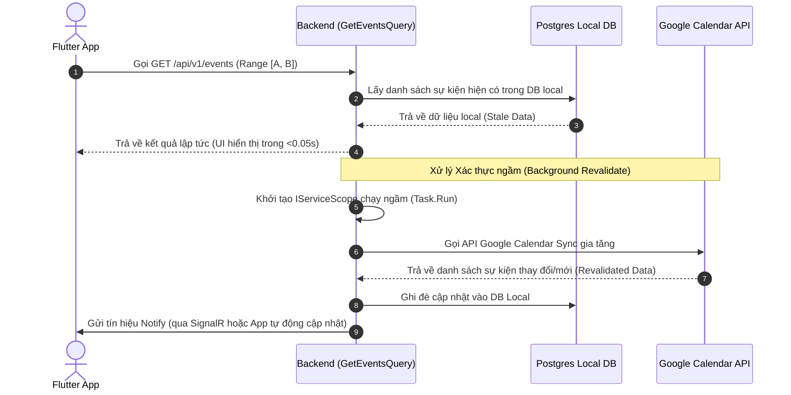

# Cơ chế Đồng bộ Stale-While-Revalidate cho Google Calendar

Tài liệu này mô tả chi tiết phương pháp tiếp cận **Stale-While-Revalidate (SWR)** được áp dụng để đồng bộ hóa dữ liệu Google Calendar về ứng dụng Habit Tracker, đảm bảo hiệu năng tối đa cho giao diện người dùng và tính nhất quán dữ liệu liên tục.

---

## 1. Vấn đề của phương pháp cũ

Trước đây, khi người dùng mở màn hình Lịch:
* Backend kiểm tra khoảng ngày xem trong bảng `GoogleCalendarSyncCaches`.
* Nếu khoảng ngày đó đã được đồng bộ một lần trong quá khứ, backend sẽ chặn hoàn toàn việc gọi API Google để tối ưu tốc độ tải trang.
* **Hạn chế:** Nếu người dùng thay đổi sự kiện trực tiếp trên Google Calendar Web/App di động và Webhook bị ngắt kết nối (hoặc không hoạt động ở môi trường local), thay đổi đó sẽ **không bao giờ** được tự động cập nhật về app khi người dùng mở lịch.

---

## 2. Giải pháp: Stale-While-Revalidate (SWR)

SWR giải quyết bài toán này bằng cách trả về kết quả local trước, sau đó xác thực lại dữ liệu ngầm (asynchronously revalidate) thông qua các bước:



---

## 3. Các bước triển khai chi tiết

### A. Vá lỗi Webhook Scope Disposal
Khi Webhook của Google Calendar gọi về endpoint `/api/v1/webhooks/google-calendar`, backend không được sử dụng `ISender` trực tiếp của HttpContext hiện tại trong tiến trình chạy ngầm.
* **Giải pháp:** Sử dụng `IServiceScopeFactory` để tạo một `IServiceScope` độc lập chạy ngầm. Điều này giúp tiến trình ngầm không bị `ObjectDisposedException` khi HTTP request kết thúc.

### B. Tích hợp SWR vào `GetEventsQuery`
Mỗi khi API lấy danh sách sự kiện được gọi:
1. Truy vấn DB local để lấy các sự kiện hiện có và trả về ngay lập tức cho Client.
2. Kiểm tra nếu người dùng đã liên kết Google Calendar:
   * Nếu cache đồng bộ cho khoảng thời gian này cũ hơn **1 phút**, kích hoạt tiến trình đồng bộ ngầm sử dụng `IServiceScopeFactory` độc lập.
   * Tiến trình ngầm gọi Google API, lấy dữ liệu mới lưu vào DB và cập nhật lại thời gian đồng bộ cuối cùng.

### C. Cơ chế Cập nhật Tức thì (Client-side SWR & SignalR)
Do tiến trình đồng bộ ngầm chạy sau khi HTTP response kết thúc, Client (Flutter App) cần một kênh phản hồi để biết khi nào dữ liệu trong DB local thay đổi.

1. **SignalR Push (Real-time)**:
   * Sau khi Backend hoàn thành đồng bộ dữ liệu Google Calendar (cả từ Webhook hoặc SWR ngầm), nó sẽ gửi một sự kiện `CalendarUpdatedEvent` thông qua MediatR.
   * Bộ xử lý sự kiện `CalendarUpdatedEventHandler` nhận thông tin và gửi tín hiệu `"CalendarUpdated"` đến Client được chỉ định qua SignalR Hub `/socialHub`:
     ```csharp
     await _hubContext.Clients.User(notification.UserId).SendAsync("CalendarUpdated", cancellationToken);
     ```
2. **Xác thực kết nối WebSocket**:
   * Do client di động kết nối WebSocket qua query string `?access_token=...` và mặc định ASP.NET Core Identity Bearer Token không tự động trích xuất query string này, một Middleware tùy biến được thêm vào `Program.cs` để sao chép token vào Header `Authorization: Bearer <token>` trước khi tiến trình Authentication chạy.
3. **Flutter Client-side SWR**:
   * Lớp `EventsNotifier` lắng nghe tín hiệu `"CalendarUpdated"` từ SignalR toàn cục (`signalrConnectionProvider`). Khi nhận được, nó kích hoạt `ref.invalidateSelf()` để kéo dữ liệu mới vẽ lại giao diện mà không cần chuyển tab hay Hot Reload.
   * Để tránh lặp vô hạn (Infinite Loop) do việc kéo dữ liệu làm hàm `build()` chạy lại, trạng thái `GoogleCalendarSyncTracker` được bật `@Riverpod(keepAlive: true)` để ghi nhớ thời gian đồng bộ cuối cùng và chỉ cho phép kích hoạt sync ngầm mới sau 1 phút.
   * Kết nối SignalR được cấu hình `.withAutomaticReconnect()` để tự động phục hồi kết nối tức thì khi server bị ngắt quãng hoặc khởi động lại.

### D. Định tuyến Webhook chuẩn xác
* Class `GoogleCalendarWebhook` kế thừa từ `EndpointGroupBase` được ghi đè `GroupName => "webhooks"` để ghi đè route group mặc định của .NET.
* Điều này giúp endpoint webhook của Google được khớp chính xác tuyệt đối với đường dẫn callback đăng ký `/api/v1/webhooks/google-calendar`, tránh lỗi `404 Not Found` khi Google Calendar gửi cập nhật.
