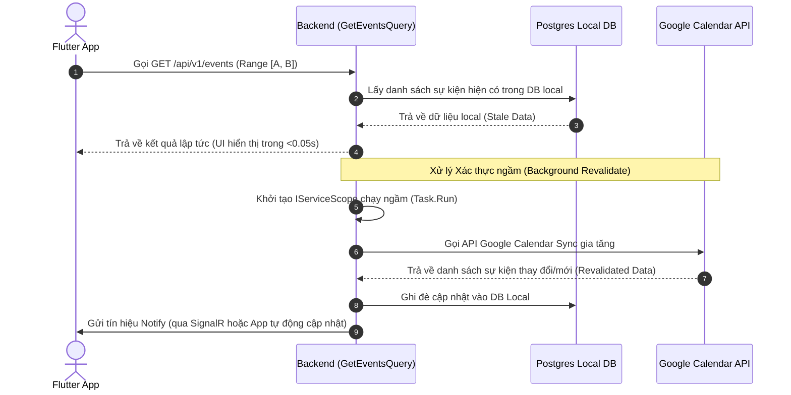

# Cơ chế Đồng bộ Stale-While-Revalidate cho Google Calendar

Tài liệu này mô tả chi tiết phương pháp tiếp cận **Stale-While-Revalidate (SWR)** được áp dụng để đồng bộ hóa dữ liệu Google Calendar về ứng dụng Habit Tracker, đảm bảo hiệu năng tối đa cho giao diện người dùng và tính nhất quán dữ liệu liên tục.

---

## 1. Vấn đề của phương pháp cũ

Trước đây, khi người dùng mở màn hình Lịch:
* Backend kiểm tra khoảng ngày xem trong bảng `GoogleCalendarSyncCaches`.
* Nếu khoảng ngày đó đã được đồng bộ một lần trong quá khứ, backend sẽ chặn hoàn toàn việc gọi API Google để tối ưu tốc độ tải trang.
* **Hạn chế:** Nếu người dùng thay đổi sự kiện trực tiếp trên Google Calendar Web/App di động và Webhook bị ngắt kết nối (hoặc không hoạt động ở môi trường local), thay đổi đó sẽ **không bao giờ** được tự động cập nhật về app khi người dùng mở lịch.

---

## 2. Giải pháp: Stale-While-Revalidate (SWR)

SWR giải quyết bài toán này bằng cách trả về kết quả local trước, sau đó xác thực lại dữ liệu ngầm (asynchronously revalidate) thông qua các bước:

```mermaid
sequenceDiagram
    autonumber
    actor Client as Flutter App
    participant API as Backend (GetEventsQuery)
    participant DB as Postgres Local DB
    participant Google as Google Calendar API

    Client->>API: Gọi GET /api/v1/events (Range [A, B])
    API->>DB: Lấy danh sách sự kiện hiện có trong DB local
    DB-->>API: Trả về dữ liệu local (Stale Data)
    API-->>Client: Trả về kết quả lập tức (UI hiển thị trong <0.05s)

    Note over API, Google: Xử lý Xác thực ngầm (Background Revalidate)
    API->>API: Khởi tạo IServiceScope chạy ngầm (Task.Run)
    API->>Google: Gọi API Google Calendar Sync gia tăng
    Google-->>API: Trả về danh sách sự kiện thay đổi/mới (Revalidated Data)
    API->>DB: Ghi đè cập nhật vào DB Local
    API->>Client: Gửi tín hiệu Notify (qua SignalR hoặc App tự động cập nhật)
```

---

## 3. Các bước triển khai chi tiết

### A. Vá lỗi Webhook Scope Disposal
Khi Webhook của Google Calendar gọi về endpoint `/api/v1/webhooks/google-calendar`, backend không được sử dụng `ISender` trực tiếp của HttpContext hiện tại trong tiến trình chạy ngầm.
* **Giải pháp:** Sử dụng `IServiceScopeFactory` để tạo một `IServiceScope` độc lập chạy ngầm. Điều này giúp tiến trình ngầm không bị `ObjectDisposedException` khi HTTP request kết thúc.

### B. Tích hợp SWR vào `GetEventsQuery`
Mỗi khi API lấy danh sách sự kiện được gọi:
1. Truy vấn DB local để lấy các sự kiện hiện có và trả về ngay lập tức cho Client.
2. Kiểm tra nếu người dùng đã liên kết Google Calendar:
   * Kích hoạt một tiến trình chạy ngầm sử dụng `IServiceScopeFactory` để gọi lệnh `SyncGoogleCalendarCommand`.
   * Lệnh này sẽ tự động gọi lên Google API để cập nhật dữ liệu mới nhất vào database.
3. Khi Client nhận được kết quả tức thì, nó vẫn hiển thị lịch bình thường. Sau khi tiến trình đồng bộ ngầm hoàn tất, nếu DB có sự thay đổi, màn hình Lịch sẽ tự động hiển thị dữ liệu mới.
