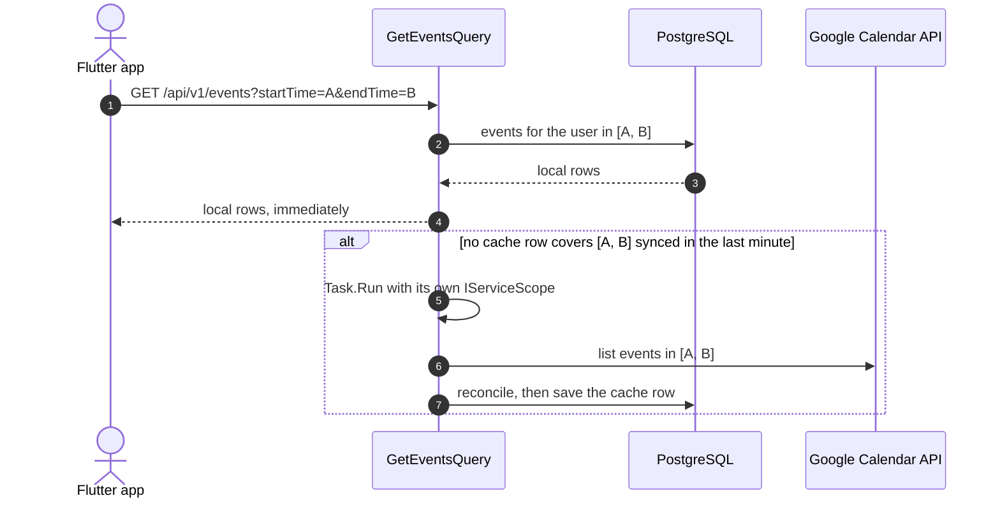

# Stale-while-revalidate event loading

Why opening the calendar shows local data immediately and then updates it, how the three
refresh mechanisms fit together, and what each one does and does not guarantee.

**Status:** matches the code as of September 2026. Read `google-calendar-sync-architecture.md`
first for the outbox and the reconciliation itself.

---

## 1. The problem it solves

The first implementation checked `GoogleCalendarSyncCaches` and, if a date range had *ever* been
synced, never called Google for it again. That made the calendar fast. But a change made directly
in Google Calendar (web or phone) reached the app only through the webhook, and the webhook does not
work without a public HTTPS tunnel — the normal state of a local development machine. So those
changes could fail to appear, indefinitely.

## 2. The approach

Serve what the database has **now**, and refresh from Google **behind** the response, at most once a
minute per range:

```mermaid
sequenceDiagram
    autonumber
    actor App as Flutter app
    participant API as GetEventsQuery
    participant DB as PostgreSQL
    participant Google as Google Calendar API

    App->>API: GET /api/v1/events?startTime=A&endTime=B
    API->>DB: events for the user in [A, B]
    DB-->>API: local rows
    API-->>App: local rows, immediately
    alt no cache row covers [A, B] synced in the last minute
        API->>API: Task.Run with its own IServiceScope
        API->>Google: list events in [A, B]
        API->>DB: reconcile, then save the cache row
    end
```

The response never waits for Google. The price is that the rows returned can be up to one sync
behind.

## 3. The three refresh mechanisms

| Mechanism | Where | When | Effect on the screen |
| --- | --- | --- | --- |
| **On-read revalidation** | `GetEventsQuery` | a fetch whose range has no fresh cache row | none immediately — it does **not** publish `CalendarUpdatedEvent`, so the new rows appear on the next fetch |
| **Client-triggered sync** | `EventsNotifier._triggerBackgroundSync` → `POST /api/v1/google-calendar/sync` | when the events provider builds, at most once a minute (`GoogleCalendarSyncTracker`, kept alive) | the client refetches when the call returns, and the server also publishes `CalendarUpdatedEvent` |
| **Webhook** | `GoogleCalendarWebhook` → `SyncGoogleCalendarCommand` | when Google reports a change | `CalendarUpdatedEvent` → SignalR `"CalendarUpdated"` → the client refetches |

`SyncGoogleCalendarCommand` is the only publisher of `CalendarUpdatedEvent`. That is deliberate. The
on-read path runs *because* a fetch happened, so if it also told the client to refetch, every fetch
could trigger another one.

## 4. Implementation notes

### Background work needs its own scope

Both the webhook and the on-read path keep working after the HTTP response has been sent. By then
the request's services are disposed, so each background task calls
`IServiceScopeFactory.CreateScope()` and resolves its own `ISender` or `IGoogleCalendarService`.
Using the request's instances instead throws `ObjectDisposedException`.

### The freshness check

`GoogleCalendarSyncCacheRepository.IsRangeSyncedAsync` returns true when **one** cache row covers the
whole requested range and was synced within the last minute. `SaveSyncRangeAsync` merges overlapping
rows, so browsing back and forth does not multiply them.

The one-minute check is measured against `LastSyncedAt`. The events provider always widens its
request to include the coming week (`eventsFetchRange` in `events_provider.dart`), and that window
moves with the clock, so a Home screen's range rarely matches an existing cache row exactly. In
practice most Home fetches start a revalidation (review of `feat/home-page`, finding 6, still open).

### SignalR delivery

- `CalendarUpdatedEventHandler` sends `"CalendarUpdated"` to `Clients.User(userId)` on `SocialHub`
  (`/socialHub`).
- The Flutter SignalR client passes the token in the query string. `Program.cs` copies
  `?access_token=` into the `Authorization` header for `/socialHub` paths; this middleware must run
  **before** `UseAuthentication()`.
- The connection (`signalrConnectionProvider`, kept alive) uses `.withAutomaticReconnect()`.
- `EventsNotifier` re-registers the handler on every build and removes it on dispose, so a rebuild
  does not stack duplicate handlers.

### Avoiding a refresh loop on the client

The client-triggered sync invalidates the events provider when it returns, and the provider's build
starts the client-triggered sync. `GoogleCalendarSyncTracker` breaks the cycle: it records when the
last sync started, is kept alive across rebuilds, and suppresses another sync within a minute. The
tracker is updated *before* the call, so concurrent builds cannot start two.

### Webhook route

`GoogleCalendarWebhook` overrides `GroupName => "webhooks"`, so the endpoint is served at
`/api/v1/webhooks/google-calendar`. That is the callback URL registered with Google; the default
group name would not match it, and Google would receive a 404.

## 5. Limits

- On-read revalidation is fire-and-forget. Its failures go to the console only (roadmap 5.7).
- Freshness is per range, not per event, and the moving fetch window defeats the cache often, as
  noted above.
- Reconciliation removes local events missing from a windowed list without restricting removals to
  that window (see `google-calendar-sync-architecture.md` §5, roadmap 5.8).
